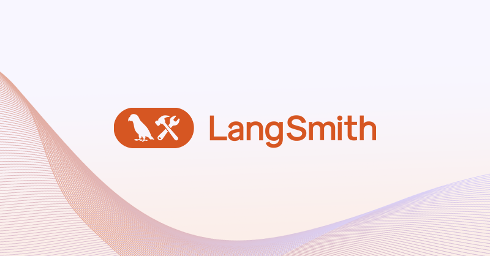
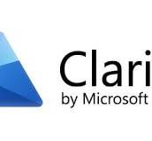

# ai-moneychanger 1.0
A project using LLM and API to convert the native language money change request  

# Project published URL : https://ai-moneychanger.streamlit.app/

## Tech Stack 

1.  Streamlit 
2.  Exchangerate-api 
3.  Replit IDE  
4.  Github OpenAI GPT-4o mini   
5.  Langchain Smith 
6.  Microsoft clarity 
7.  Streamlit App Cloud 
8.  Python 

### Author 

Jie Chen @ 2025